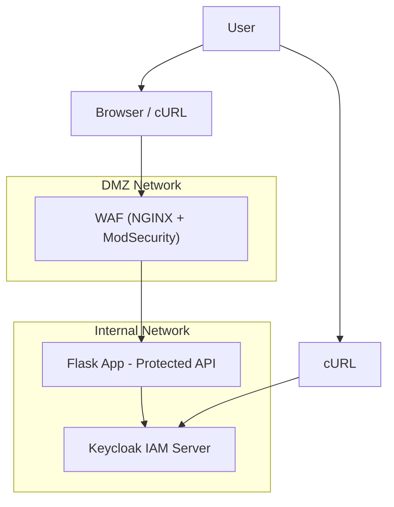

# 🛡️ IAM Architecture with Flask, Keycloak, WAF, TLS 1.3 and DMZ (Docker Compose)

This project demonstrates a secure **Identity and Access Management (IAM)** architecture using:

- 🛡️ [NGINX](https://www.nginx.com/)-based Web Application Firewall (WAF) to filter and protect incoming traffic
- 🌐 Simulated DMZ using Docker networks to isolate internal services
- 🔐 [Keycloak](https://www.keycloak.org/) as the Identity Provider
- 🐍 Flask as a protected Python API
- 🐳 Docker Compose for container orchestration

---

## 📐 Architecture Diagram



---

## ⚙️ Features

- 🔐 End-to-end encryption with TLS 1.3:
  - Between users and the WAF (HTTPS)
  - Between WAF and Flask app
  - Between Flask app and Keycloak
- 🌐 Simulated DMZ using Docker networks to isolate internal services
- 🔒 Token-based access control via Keycloak (OpenID Connect)
- ✅ Public and protected API routes in Flask
- 🧪 Test automation using Makefile
- 📈 Docker security checks with Docker Bench for Security
- 🟢 Health checks for all services
- 🧱 Hardened container config using `read_only`, `cap_drop`, `security_opt`, and resource limits

---

## 📁 Project Structure

```


├── certs/
│   ├── flask.crt
│   ├── flask.key
│   ├── server.crt
│   ├── server.key
├── flaskapp/
│   ├── app.py
│   ├── requirements.txt
│   └── Dockerfile
├── .env
├── docker-compose.yml
├── keycloak-setup.sh
├── Makefile
├── my_proxy.conf
├── README.md
├── realm-config.json
└── test-flask.sh
```

---

## 📁 Key Components Reviewed

| Component | Evaluation |
|----------|------------|
| `docker-compose.yml` | ✅ Hardened containers (memory, pids, CPU, capabilities), health checks |
| `Makefile` | ✅ Streamlined automation with `reset`, `check`, `setup-keycloak` targets |
| `keycloak-setup.sh` | ✅ Creates realm, client, user with correct attributes and secure password setup |
| `test-flask.sh` | ✅ Validates JWT auth against Flask endpoints using curl and bearer tokens |
| `flaskapp/app.py` | ✅ Verifies token using python-jose, with structured error logging |
| `Dockerfile` | ✅ Non-root user, minimal Alpine base, healthcheck added |
| `.env` | ✅ Used consistently across scripts and compose |
| `README.md` | ✅ Includes usage, architecture, and security hardening notes |
| `realm-config.json` | ✅ Optional backup or export of realm settings |
| `my_proxy.conf` | ✅ WAF configuration file |
| Security | ✅ Applied Bandit checks, Docker Bench findings addressed where feasible |

---

## 🚀 Quick Start

### 🔧 Prerequisites

- Docker + Docker Compose
- Make
- `jq` (for parsing tokens)
- Git Bash or a Unix-like terminal on Windows

---

### 🔨 Build and Run

```bash
make reset           # Cleans, builds, and starts the environment
make setup-keycloak  # Creates Keycloak realm, client, and test user
```

---

### 🔐 API Endpoints

| Endpoint        | Auth Required | Description              |
|-----------------|---------------|--------------------------|
| `/public`       | ❌ No          | Public endpoint          |
| `/protected`    | ✅ Yes         | Requires Bearer token    |
| `/health`       | ❌ No          | Used by Docker healthcheck |

---

## 🧪 Testing Access

```bash
make test-flask
```

This will:

- Call `/public` (200 OK)
- Call `/protected` without token (401 Unauthorized)
- Call `/protected` with a valid token (200 OK)

---

## 🔧 Keycloak Default Settings

| Setting       | Value            |
|---------------|------------------|
| Realm         | `demo-realm`     |
| Client ID     | `flask-client`   |
| Client Secret | `secret`         |
| Username      | `testuser`       |
| Password      | `testpass`       |

You can log in to the [Keycloak Admin Console](http://localhost:8080/admin/) using:

- **Username:** `admin`
- **Password:** `admin`

---

## 🔒 Security Hardening Notes

The IAM environment is hardened with multiple Docker security measures for both the Flask and Keycloak services.

### 🧱 Container Runtime Security

| Control                   | `keycloak`                          | `flaskapp`                                 | Purpose                                                                 |
|---------------------------|-------------------------------------|---------------------------------------------|-------------------------------------------------------------------------|
| `read_only`               | ❌ Not set                          | ✅ `read_only: true`                        | Prevents write access to container filesystem                          |
| `security_opt`            | `label=type:container_t`           | `label=type:container_t`, `no-new-privileges:true` | SELinux label + blocks privilege escalation                            |
| `cap_drop`                | ❌ Not set                          | ✅ `cap_drop: ALL`                          | Drops all Linux capabilities by default                                |
| `cap_add`                 | ❌ Not set                          | ✅ `NET_RAW`                                | Needed for `curl` in Alpine healthcheck                                |
| `restart` policy          | ✅ `on-failure:5`                   | ✅ `on-failure:5`                           | Resilience with limited retry attempts                                 |
| `healthcheck`             | ✅ Configured (realm check)         | ✅ Configured (`/health` endpoint)          | Ensures services are monitored and restarted if unhealthy              |

---

### 🚦 Resource Limits

| Resource | Limit     | Applies To   | Purpose                                         |
|----------|-----------|--------------|-------------------------------------------------|
| Memory   | `512M` (Keycloak), `200M` (Flask) | Both | Prevents excessive memory usage              |
| PIDs     | `300` (Keycloak), `100` (Flask)   | Both | Limits thread/process spawning               |
| CPU      | `cpu_quota: 100000` (Keycloak), `50000` (Flask) | Both | Explicitly limits CPU usage (1.0 & 0.5 cores) |

---

### 🛡️ Web Application Firewall (WAF) (TLS 1.3 Enabled)

A new `waf` service has been added using **NGINX with ModSecurity** and the **OWASP Core Rule Set** to provide first-line protection for the Flask API.

#### Benefits:
- Provides TLS 1.3 termination to secure external communication
- Blocks common attacks (SQLi, XSS, CSRF, etc.)
- Provides logging and visibility into web-layer threats
- Acts as a reverse proxy between users and the Flask app

#### Hardened WAF Settings:

| Control                   | `waf`                                       | Purpose                                                                 |
|---------------------------|---------------------------------------------|-------------------------------------------------------------------------|
| `security_opt`            | ✅ `no-new-privileges:true`                  | Blocks privilege escalation inside the container                       |
| `cap_drop`                | ✅ `ALL`                                     | Drops all Linux capabilities                                           |
| `cap_add`                 | ✅ `NET_BIND_SERVICE`                        | Only permits port binding for HTTP service                             |
| `tmpfs`                   | ✅ `/tmp`                                    | Mounts temporary storage in memory                                     |
| `deploy.resources.limits`| ✅ memory and PID constraints                | Prevents resource exhaustion attacks                                   |

The WAF listens on **port 15000** and forwards requests to the internal Flask app running on port 5000.

---

### 💾 Volume Isolation

| Volume         | Purpose                          |
|----------------|----------------------------------|
| `keycloak-data`| Stores realm config and user data |
| _(none)_       | Flask app is stateless and readonly |

---

## 🧱 Docker Network Isolation

| Service    | Network(s)           | Public Access | Purpose                         |
|------------|----------------------|----------------|---------------------------------|
| WAF        | `dmz`, `internal`     | ✅ via port 15000 | Filters and proxies traffic     |
| Flask App  | `internal`            | ❌             | Processes JWT-authenticated requests |
| Keycloak   | `internal`            | ❌             | Identity provider & token issuer |

---

## 📦 Useful Makefile Targets

```bash
make build           # Docker Compose build
make start           # Start containers
make stop            # Stop containers
make logs            # View logs
make setup-keycloak  # Configure Keycloak realm, client, user
make test-flask      # Run test to validate protected access
make clean           # System prune
make reset           # Full clean, build, and start
```

---

## 🔐 OAuth 2.0 and OIDC Flows Implemented

This project uses the **Resource Owner Password Credentials Grant** flow from OAuth 2.0, enhanced with OpenID Connect (OIDC) for identity support.

Now with a **Web Application Firewall (WAF)** acting as the entry point, the flow is secured through an additional network enforcement layer.

### Flow Summary:

1. **User** sends credentials to the WAF endpoint.
2. **WAF** filters and forwards the request to Keycloak (inside the internal Docker network).
3. **Keycloak** verifies credentials and issues:
   - `access_token` (OAuth 2.0)
   - `id_token` (OIDC)
4. **Client (e.g., browser or curl)** sends the `access_token` in the `Authorization: Bearer` header to the WAF.
5. **WAF** verifies request patterns, applies ModSecurity rules, and forwards to Flask if allowed.
6. **Flask app** uses Keycloak’s public key to verify the JWT token and authorize the request.

### OIDC Claim Use

The JWT includes OIDC claims such as `email_verified`, `preferred_username`, `given_name`, and `family_name`, which establish trusted identity across the protected internal network.

---

## 🔐 Security Analysis (STRIDE)

| STRIDE Threat           | Risk Description                                  | Mitigation Applied                                                                 |
|-------------------------|----------------------------------------------------|-------------------------------------------------------------------------------------|
| **S**poofing            | Forged tokens to impersonate users                | JWT signature validation with RS256 using Keycloak’s public key + WAF inspection   |
| **T**ampering           | Token or API request manipulation                 | WAF filters and blocks malformed or malicious traffic before it reaches Flask      |
| **R**epudiation         | User denial of actions                            | JWT includes `sub`, `iat`, and session ID for traceability                         |
| **I**nformation Disclosure | Exposure of sensitive data or credentials      | TLS 1.3 encrypts all communication paths (User ↔ WAF, WAF ↔ Flask, Flask ↔ Keycloak); DMZ restricts lateral access; `.env` secrets are not in images or responses |
| **D**enial of Service   | Exhaustion of system resources                    | WAF rate-limiting, ModSecurity rules, and container resource constraints applied   |
| **E**levation of Privilege | Unauthorized access to protected routes       | Token roles must match realm roles; WAF inspects traffic for injection attempts    |
---

## 🧠 Reflection on the Okta Case Study

### Incident Summary:
Okta experienced breaches due to:
- Improper access controls for third-party contractors
- Session token hijacking
- Excessive role privileges and poor telemetry

### Impacts on This Project:

| Okta Lesson            | Mitigation in Your Project                                                |
|------------------------|---------------------------------------------------------------------------|
| Token hijacking        | WAF filters malformed headers and can block oversized or replayed tokens |
| Overprivileged accounts| Only minimal roles and test user with scoped client access                |
| Insecure credentials   | Secrets isolated via `.env` and never hard-coded                         |
| No central audit       | WAF logs and structured Flask error logging enable visibility             |
| Insufficient segmentation | DMZ isolates internal services and prevents lateral movement          |

The inclusion of a **WAF and DMZ** reinforces principles of **network isolation**, **centralized ingress control**, and **least privilege**, directly addressing gaps exposed in the Okta incident.

---

## ✅ Summary

This IAM architecture demonstrates:
- A Web Application Firewall (WAF) protecting the API layer
- TLS 1.3 encryption enforced throughout: user to WAF, WAF to Flask, and Flask to Keycloak
- A Docker-based DMZ network to protect internal identity and API components
- A secure OAuth 2.0 + OIDC implementation with Keycloak and Flask
- Container hardening with Docker resource limits, `cap_drop`, and health checks
- Threat modeling with STRIDE and corresponding mitigations
- Learned practices from real-world identity breaches (Okta)

---

## 📘 References

- [Keycloak Documentation](https://www.keycloak.org/docs/latest/)
- [Docker Bench for Security](https://github.com/docker/docker-bench-security)
- [NGINX](https://www.nginx.com/)
- [Flask](https://flask.palletsprojects.com/)
- [Python-JOSE](https://python-jose.readthedocs.io/en/latest/)
- [TLS 1.3 Specification - RFC 8446](https://datatracker.ietf.org/doc/html/rfc8446): Defines the Transport Layer Security (TLS) Protocol Version 1.3, which improves security and performance over previous versions.
- [Mozilla SSL Configuration Guidelines](https://ssl-config.mozilla.org/): A widely used resource for recommended TLS settings, including secure cipher suites and protocol versions for NGINX.


---

## 🧑‍💻 Author

**Timothy Brennan**  
For educational use in IAM and container security labs.

---