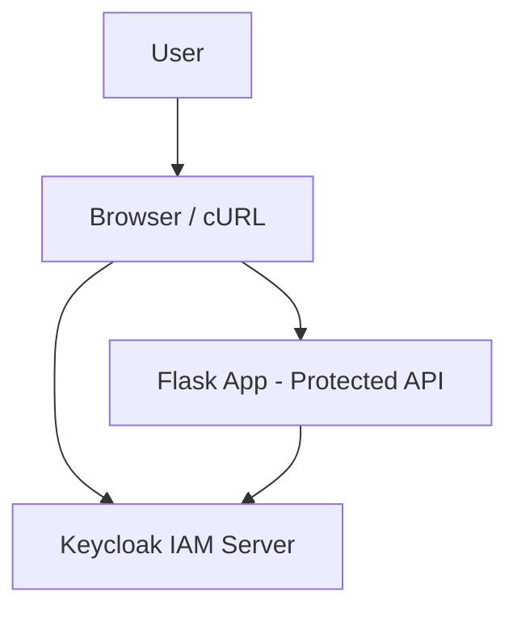

# 🛡️ IAM Architecture with Flask, Keycloak, and Docker Compose

This project demonstrates a secure **Identity and Access Management (IAM)** architecture using:

- 🔐 [Keycloak](https://www.keycloak.org/) as the Identity Provider
- 🐍 Flask as a protected Python API
- 🐳 Docker Compose for container orchestration

---

## 📐 Architecture Diagram



---

## ⚙️ Features

- 🔒 Token-based access control via Keycloak (OpenID Connect)
- ✅ Public and protected API routes in Flask
- 🧪 Test automation using Makefile
- 📈 Docker security checks with Docker Bench for Security
- 🟢 Health checks for both containers
- 🧱 Hardened container config using `read_only`, `cap_drop`, `security_opt`, and memory/CPU/PID limits

---

## 📁 Project Structure

```
.
├── flaskapp/
│   ├── app.py
│   ├── requirements.txt
│   └── Dockerfile
├── .env
├── docker-compose.yml
├── keycloak-setup.sh
├── Makefile
├── README.md
├── realm-config.json
└── test-flask.sh
```

---

## 🚀 Quick Start

### 🔧 Prerequisites

- Docker + Docker Compose
- Make
- `jq` (for parsing tokens)
- Git Bash or a Unix-like terminal on Windows

---

### 🔨 Build and Run

```bash
make reset           # Cleans, builds, and starts the environment
make setup-keycloak  # Creates Keycloak realm, client, and test user
```

---

### 🔐 API Endpoints

| Endpoint        | Auth Required | Description              |
|-----------------|---------------|--------------------------|
| `/public`       | ❌ No          | Public endpoint          |
| `/protected`    | ✅ Yes         | Requires Bearer token    |
| `/health`       | ❌ No          | Used by Docker healthcheck |

---

## 🧪 Testing Access

```bash
make test-flask
```

This will:

- Call `/public` (200 OK)
- Call `/protected` without token (401 Unauthorized)
- Call `/protected` with a valid token (200 OK)

---

## 🔧 Keycloak Default Settings

| Setting       | Value            |
|---------------|------------------|
| Realm         | `demo-realm`     |
| Client ID     | `flask-client`   |
| Client Secret | `secret`         |
| Username      | `testuser`       |
| Password      | `testpass`       |

You can log in to the [Keycloak Admin Console](http://localhost:8080/admin/) using:

- **Username:** `admin`
- **Password:** `admin`

---

## 🔒 Security Hardening Notes

The IAM environment is hardened with multiple Docker security measures for both the Flask and Keycloak services.

### 🧱 Container Runtime Security

| Control                   | `keycloak`                          | `flaskapp`                                 | Purpose                                                                 |
|---------------------------|-------------------------------------|---------------------------------------------|-------------------------------------------------------------------------|
| `read_only`               | ❌ Not set                          | ✅ `read_only: true`                        | Prevents write access to container filesystem                          |
| `security_opt`            | `label=type:container_t`           | `label=type:container_t`, `no-new-privileges:true` | SELinux label + blocks privilege escalation                            |
| `cap_drop`                | ❌ Not set                          | ✅ `cap_drop: ALL`                          | Drops all Linux capabilities by default                                |
| `cap_add`                 | ❌ Not set                          | ✅ `NET_RAW`                                | Needed for `curl` in Alpine healthcheck                                |
| `restart` policy          | ✅ `on-failure:5`                   | ✅ `on-failure:5`                           | Resilience with limited retry attempts                                 |
| `healthcheck`             | ✅ Configured (realm check)         | ✅ Configured (`/health` endpoint)          | Ensures services are monitored and restarted if unhealthy              |

---

### 🚦 Resource Limits

| Resource | Limit     | Applies To   | Purpose                                         |
|----------|-----------|--------------|-------------------------------------------------|
| Memory   | `512M` (Keycloak), `200M` (Flask) | Both | Prevents excessive memory usage              |
| PIDs     | `300` (Keycloak), `100` (Flask)   | Both | Limits thread/process spawning               |
| CPU      | `cpu_quota: 100000` (Keycloak), `50000` (Flask) | Both | Explicitly limits CPU usage (1.0 & 0.5 cores) |

---

### 💾 Volume Isolation

| Volume         | Purpose                          |
|----------------|----------------------------------|
| `keycloak-data`| Stores realm config and user data |
| _(none)_       | Flask app is stateless and readonly |

---

## 📦 Useful Makefile Targets

```bash
make build           # Docker Compose build
make start           # Start containers
make stop            # Stop containers
make logs            # View logs
make setup-keycloak  # Configure Keycloak realm, client, user
make test-flask      # Run test to validate protected access
make clean           # System prune
make reset           # Full clean, build, and start
```

---

## 📘 References

- [Keycloak Documentation](https://www.keycloak.org/docs/latest/)
- [Docker Bench for Security](https://github.com/docker/docker-bench-security)
- [Flask](https://flask.palletsprojects.com/)
- [Python-JOSE](https://python-jose.readthedocs.io/en/latest/)

---

## 🧑‍💻 Author

**Timothy Brennan**  
For educational use in IAM and container security labs.

---